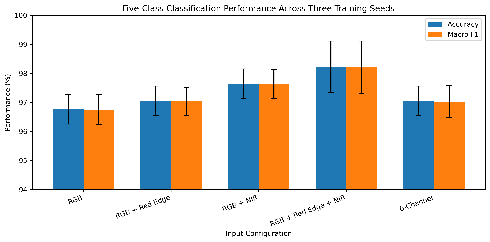

# Spectral Input Analysis for Maize Condition Classification

> An exploratory deep learning study of spectral input selection for maize condition classification and common rust–water stress discrimination.

## Abstract

Multispectral imagery provides information beyond the visible RGB spectrum and has shown potential for crop health and disease assessment. However, the contribution of individual spectral inputs to deep-learning-based crop condition classification remains an important question, particularly when visually or spectrally similar stress conditions must be distinguished.

This exploratory study investigates how spectral input selection affects maize condition classification and the discrimination of common rust disease from water stress. Using a prepared subset of a UAV-derived multispectral maize dataset, a pretrained ResNet18 was evaluated under five input configurations: RGB, RGB + Red Edge, RGB + NIR, RGB + Red Edge + NIR, and a 6-channel input. To assess training variability, each configuration was trained using three random seeds while keeping the train, validation, and test split fixed.

Across the three runs, RGB + Red Edge + NIR achieved the highest mean five-class performance, with **98.23 ± 0.88% accuracy** and **98.21 ± 0.90% macro F1-score**. The same configuration achieved **99.51 ± 0.85% accuracy** in a task-specific analysis distinguishing common rust from water-stress conditions. The 6-channel input did not outperform the selected RGB + Red Edge + NIR configuration, suggesting that increasing the number of input channels does not necessarily improve classification performance in this experimental setting.

These findings are preliminary and should be interpreted within the limitations of the small prepared dataset and fixed patch-level split. Further evaluation on independent field- or source-level data is required to determine whether the observed spectral-input effects generalize to real-world agricultural remote-sensing conditions.

## 1. Introduction

Remote sensing and deep learning are increasingly used for automated crop monitoring, providing image-based approaches for assessing plant health, disease, and stress conditions [1,2]. Beyond conventional RGB imagery, multispectral sensing captures information from additional wavelength regions, including Red Edge and near-infrared (NIR), which can provide complementary information about vegetation condition [3].

Previous studies have demonstrated the potential of spectral and multispectral imagery for plant disease detection. Hyperspectral measurements have been investigated for identifying spectral variables associated with potato late blight [4], while close-range multispectral imagery has been used to distinguish healthy and infected cucumber plants [5]. Recent work on maize has also investigated UAV-based multispectral imagery containing visible, Red Edge, and NIR information for disease detection and mapping [3].

However, increasing the amount of spectral information does not necessarily imply that every available input channel contributes equally to classification. Spectral band selection has therefore become an important research direction for identifying informative wavelength regions while reducing redundant input information [6]. In addition, distinguishing biotic stress caused by disease from abiotic stress such as water limitation remains challenging because different stress mechanisms can produce overlapping spectral responses [7].

Motivated by these observations, this exploratory study investigates spectral input selection under a controlled deep-learning setting. Using the same ResNet18 architecture, data split, and training procedure, five input configurations are compared:

- RGB
- RGB + Red Edge
- RGB + NIR
- RGB + Red Edge + NIR
- 6-channel input

The study focuses on two research questions:

**RQ1:** How does spectral input selection affect five-class maize condition classification?

**RQ2:** How reliably can different spectral input configurations distinguish common rust disease from water-stress conditions?

## 2. Related Work

### Spectral Imaging for Plant Disease and Stress Detection

Spectral imaging has been widely investigated for identifying plant health conditions that may not be fully characterized using visible RGB information alone. Fernández et al. [4] investigated hyperspectral measurements for potato late blight detection at both leaf and canopy levels, examining spectral variables associated with disease symptoms. In subsequent work, close-range multispectral imagery was used to distinguish healthy and powdery-mildew-infected cucumber plants [5].

More recent UAV-based studies have extended these approaches to field-scale crop monitoring. Multispectral imagery containing visible, Red Edge, and NIR information has been investigated for maize disease detection and spatial mapping [3]. These studies support the use of information beyond RGB for crop-health assessment while also motivating questions about which spectral inputs provide the most useful discriminatory information.

### Spectral Input and Band Selection

Using more spectral information can increase input dimensionality and may introduce redundant information. Consequently, band-selection approaches have been investigated to identify informative wavelength regions while retaining useful classification information. Recent UAV hyperspectral research has demonstrated that selected subsets of spectral bands can preserve discriminative information for crop disease classification [6].

Rather than performing hyperspectral band selection across a large number of wavelengths, the present study examines a smaller and controlled question: how classification performance changes when Red Edge and NIR information are progressively added to an RGB baseline while the model architecture and experimental conditions remain fixed.

### Biotic vs. Abiotic Stress

A particularly important challenge in crop monitoring is distinguishing biotic stresses, such as fungal disease, from abiotic stresses, such as water limitation. Different stress mechanisms may produce partially overlapping spectral responses, making reliable discrimination difficult under real-world conditions [7].

This issue is directly relevant to the maize dataset used in this study, which contains both common rust disease and different levels of water stress [1]. In addition to five-class maize condition classification, this study therefore performs a task-specific analysis of how reliably the evaluated spectral configurations distinguish common rust from water-stress conditions.

The source dataset study [1] also evaluated five-class classification using RGB, multispectral, and multimodal feature combinations. Its classification experiments primarily examined modality-level contributions, including RGB, multispectral, wavelet, and texture information. In contrast, the present study focuses on a controlled channel-level comparison, examining how specific Red Edge and NIR additions affect classification performance while keeping the model architecture and experimental protocol fixed.

## 3. Dataset and Experimental Design

### Dataset

This study uses a prepared mini dataset derived from the UAV-based multispectral maize dataset introduced by Suiçmez et al. [1]. The original dataset was developed for the analysis of maize water stress and common rust under field conditions and contains multispectral imagery covering visible, Red Edge, and near-infrared information.

The prepared subset used in this study contains **750 image patches**, equally distributed across five classes:

- Bare soil: 150
- Healthy vegetation: 150
- High water stress: 150
- Low water stress: 150
- Common rust: 150

Each sample is available as a multi-channel TIFF image. The channel order used in the experiments is:

1. Blue
2. Green
3. Red
4. Red Edge
5. NIR
6. Alpha

The sixth channel is an alpha channel and is therefore referred to as part of the **6-channel input**, rather than as a sixth spectral band.

### Data Split

A stratified train/validation/test split was created to preserve the class distribution:

- Training: **525 images (70%)**
- Validation: **112 images (15%)**
- Test: **113 images (15%)**

The split was generated using a fixed `random_state=42` and remained identical for all spectral configurations. Matching images were selected by filename, ensuring that every configuration was evaluated using the same samples.

### Spectral Input Configurations

Five input configurations were evaluated:

| Configuration | Input Channels |
|---|---|
| RGB | Blue + Green + Red |
| RGB + Red Edge | Blue + Green + Red + Red Edge |
| RGB + NIR | Blue + Green + Red + NIR |
| RGB + Red Edge + NIR | Blue + Green + Red + Red Edge + NIR |
| 6-Channel | Blue + Green + Red + Red Edge + NIR + Alpha |

This experimental design enables a controlled comparison of how adding Red Edge and NIR information to an RGB baseline affects classification performance, while keeping the dataset, model architecture, and training procedure unchanged.

## 4. Methodology

### Model Architecture

A pretrained **ResNet18** was used as the classification model. ImageNet-pretrained weights were used to provide an initial feature representation, and the final fully connected layer was replaced with a five-class classification layer corresponding to the five maize conditions.

For the standard RGB configuration, the original three-channel input layer of ResNet18 was retained.

For configurations containing more than three channels, the first convolutional layer was modified to accept the required number of input channels. The pretrained weights for the RGB channels were preserved, while each additional channel was initialized using the mean of the pretrained RGB convolutional weights.

### Training Protocol

All spectral configurations were trained under the same experimental settings:

- Architecture: **ResNet18**
- Pretraining: **ImageNet**
- Optimizer: **Adam**
- Learning rate: **0.0001**
- Loss function: **Cross-Entropy Loss**
- Batch size: **32**
- Training epochs: **5**
- Number of output classes: **5**
- Computing device: **CPU**

Input images were converted to `float32` and normalized to the range **[0, 1]**.

### Repeated Experiments

To examine training variability, each spectral configuration was trained three times using the following random seeds:

- 42
- 123
- 2026

The train, validation, and test samples remained fixed across all runs. Therefore, the variation across the three runs reflects **training stochasticity on a fixed data split**, rather than variation resulting from different dataset partitions.

With five spectral configurations and three training seeds, a total of **15 models** were trained.

### Evaluation Metrics

Five-class classification performance was evaluated using:

- **Accuracy**
- **Macro F1-score**

The mean and standard deviation across the three training seeds were reported for each spectral configuration.

In addition to the five-class evaluation, a task-specific analysis was performed on test samples belonging to:

- Common rust
- High water stress
- Low water stress

For this analysis, a common-rust sample was considered correct only when predicted as rust, while a water-stress sample was considered correct when predicted as either high or low water stress. Predictions of healthy vegetation or bare soil were counted as errors.

This secondary analysis was derived from the predictions of the original five-class models; **no separate binary classifier was trained**.

## 5. Results

### 5.1 Five-Class Classification

Performance was evaluated across three training seeds while keeping the train, validation, and test split fixed. The table below reports the mean test accuracy and macro F1-score together with their standard deviations.

| Spectral Configuration | Accuracy (%) | Macro F1 (%) |
|---|---:|---:|
| RGB | 96.76 ± 0.51 | 96.75 ± 0.52 |
| RGB + Red Edge | 97.05 ± 0.51 | 97.03 ± 0.48 |
| RGB + NIR | 97.64 ± 0.51 | 97.62 ± 0.50 |
| **RGB + Red Edge + NIR** | **98.23 ± 0.88** | **98.21 ± 0.90** |
| 6-Channel | 97.05 ± 0.51 | 97.02 ± 0.55 |

Across the three runs, the **RGB + Red Edge + NIR** configuration achieved the highest mean five-class performance, reaching **98.23 ± 0.88% accuracy** and **98.21 ± 0.90% macro F1-score**.

Adding spectral information beyond RGB did not produce a monotonic improvement. In particular, the 6-channel configuration did not outperform the RGB + Red Edge + NIR configuration under the same experimental conditions.

### 5.2 Common Rust vs. Water-Stress Analysis

A task-specific evaluation was conducted using the **68 relevant test samples**, consisting of:

- 22 common-rust samples
- 23 high-water-stress samples
- 23 low-water-stress samples

The results were derived directly from the predictions of the five-class models.

| Spectral Configuration | Disease vs. Water-Stress Accuracy (%) |
|---|---:|
| RGB | 97.55 ± 1.70 |
| RGB + Red Edge | 98.04 ± 1.70 |
| RGB + NIR | 98.04 ± 1.70 |
| **RGB + Red Edge + NIR** | **99.51 ± 0.85** |
| 6-Channel | 98.04 ± 0.85 |

On the fixed test split, the **RGB + Red Edge + NIR** configuration achieved the highest mean task-specific accuracy, reaching **99.51 ± 0.85%** across the three training seeds.

The RGB baseline already achieved a high mean accuracy of **97.55 ± 1.70%**, indicating that the improvement obtained by adding Red Edge and NIR information was relatively modest within this dataset.

### 5.3 Performance Visualization

The following figure summarizes the five-class classification performance across the three training seeds:

## 6. Discussion

The experiments show that spectral input selection influenced classification performance even when the model architecture, data split, and training procedure were kept unchanged.

Across the three training seeds, the RGB + Red Edge + NIR configuration achieved the highest mean performance for both five-class classification and the task-specific common-rust vs. water-stress analysis. Compared with the RGB baseline, adding Red Edge and NIR increased mean five-class accuracy from 96.76% to 98.23%.

However, the results do not indicate that simply increasing the number of input channels consistently improves performance. The 6-channel configuration achieved a mean accuracy of 97.05%, below the 98.23% obtained with RGB + Red Edge + NIR. This suggests that, within this experimental setting, the usefulness of the input information may be more important than the total number of channels provided to the model.

The individual configurations also provide some preliminary insight into the contribution of additional spectral information. RGB + NIR achieved a higher mean five-class accuracy than RGB + Red Edge, while combining both Red Edge and NIR with RGB produced the highest mean performance. These observations suggest that the additional spectral channels may provide complementary information in this dataset. However, the experiment does not establish the independent causal contribution of individual bands, and further controlled evaluation would be required to make stronger conclusions about band importance.

For the common-rust vs. water-stress analysis, all configurations achieved high performance. RGB alone reached 97.55 ± 1.70% mean accuracy, while RGB + Red Edge + NIR reached 99.51 ± 0.85%. Therefore, the observed benefit of additional spectral information was relatively modest on this test set.

Importantly, the near-perfect task-specific result should not be interpreted as evidence of 99.51% accuracy under real agricultural field conditions. The analysis was conducted on a small fixed subset of the prepared dataset, and the evaluated samples do not constitute an independent field- or source-level external test set.

Overall, the results provide preliminary evidence that selecting a suitable combination of spectral inputs can be useful for maize condition classification without necessarily using every available input channel. They also motivate further evaluation of reduced spectral configurations on larger and independently collected datasets.

## 7. Limitations

This study is exploratory and has several limitations that should be considered when interpreting the results.

First, the experiments were conducted on a relatively small prepared dataset containing 750 image patches, with only 113 samples in the test set. The common-rust vs. water-stress analysis was further limited to 68 relevant test samples.

Second, all experiments used a single fixed train/validation/test split. Although three training seeds were used to examine training variability, these repetitions do not measure variability across different dataset partitions.

Third, the prepared mini dataset was constructed from samples originating from the larger source dataset, and source-level independence between training and test samples is not guaranteed. Therefore, the reported results should not be interpreted as independent field-level generalization performance.

Fourth, the 6-channel configuration includes an alpha channel in addition to the five spectral channels. Consequently, it should not be interpreted as a six-spectral-band configuration.

Finally, the experiments were performed under a single model architecture and training setup. Evaluation with additional architectures, independent datasets, and field- or source-level splits would be necessary to determine whether the observed spectral-input patterns generalize beyond the current experimental setting.

## 8. Conclusion and Future Work

This exploratory study investigated how different spectral input configurations affect maize condition classification and common-rust vs. water-stress discrimination using a pretrained ResNet18.

Across three training seeds on a fixed data split, RGB + Red Edge + NIR achieved the highest mean performance among the evaluated configurations, reaching 98.23 ± 0.88% accuracy and 98.21 ± 0.90% macro F1-score for five-class classification. The same configuration achieved 99.51 ± 0.85% accuracy in the task-specific common-rust vs. water-stress analysis.

The results also showed that using more input channels did not consistently lead to better performance, as the 6-channel configuration did not outperform RGB + Red Edge + NIR. This suggests that spectral input selection may be more useful than simply increasing the number of input channels.

Future work should evaluate these observations using larger and independently collected datasets, preferably with field- or source-level separation between training and testing data. Additional experiments could also investigate individual band contributions, alternative spectral combinations, and different deep-learning architectures.

Overall, this study provides an initial controlled analysis of spectral input selection for maize condition classification and establishes a foundation for further investigation of reliable multispectral crop monitoring.

## 9. References

[1] Ç. Suiçmez, C. Yılmaz, H. T. Kahraman, and M. A. Erdoğan,
“UAV-Derived Multispectral Datasets and Index-Guided Segmentation for Maize Water Stress and Common Rust Detection Under Real Field Conditions,”
*Applied Sciences*, vol. 16, no. 14, 6860, 2026.
https://doi.org/10.3390/app16146860

[2] J. Ubbens, I. Stavness, M. P. Pound, and W. Guo,
“Deep Learning in Plant Phenotyping: The First Ten Years,”
*Plant Phenomics*, vol. 7, no. 4, 100062, 2025.
https://doi.org/10.1016/j.plaphe.2025.100062

[3] B. L. Nkuna, W. Masiza, J. G. Chirima, S. W. Newete,
A. J. Van Der Walt, and A. Nyamugama,
“UAV-Based Multispectral Imaging and Machine Learning for Detecting and Mapping Maize Leaf Diseases in Smallholder Farms,”
*Scientific Reports*, vol. 16, 22431, 2026.
https://doi.org/10.1038/s41598-026-53092-4

[4] C. I. Fernández, B. Leblon, A. Haddadi, J. Wang, and K. Wang,
“Potato Late Blight Detection at the Leaf and Canopy Level Using Hyperspectral Data,”
*Canadian Journal of Remote Sensing*, vol. 46, no. 4, pp. 390–413, 2020.
https://doi.org/10.1080/07038992.2020.1769471

[5] C. I. Fernández, B. Leblon, J. Wang, A. Haddadi, and K. Wang,
“Detecting Infected Cucumber Plants with Close-Range Multispectral Imagery,”
*Remote Sensing*, vol. 13, no. 15, 2948, 2021.
https://doi.org/10.3390/rs13152948

[6] A. Sanaeifar, S. Kianian, R. Dill-Macky, S. Reynolds,
M. J. Moscou, R. D. Curland, J. Anderson, M. N. Rouse, and C. Yang,
“Transformer-Based and Band-Selected Models for UAV Hyperspectral Wheat Disease Classification,”
*Smart Agricultural Technology*, vol. 13, 101714, 2026.
https://doi.org/10.1016/j.atech.2025.101714

[7] S. Kafle, E. Chatraei Azizabadi, F. Daayf, C. Erkinbaev,
M. El-Shetehy, M. S. Youssef, A. Youssef, and N. Badreldin,
“Advancing Non-Invasive Technology for Early Disease Detection in Potato:
A Review of Hyperspectral Imaging Applications in Western Canada,”
*Smart Agricultural Technology*, 102500, 2026.
https://doi.org/10.1016/j.atech.2026.102500

